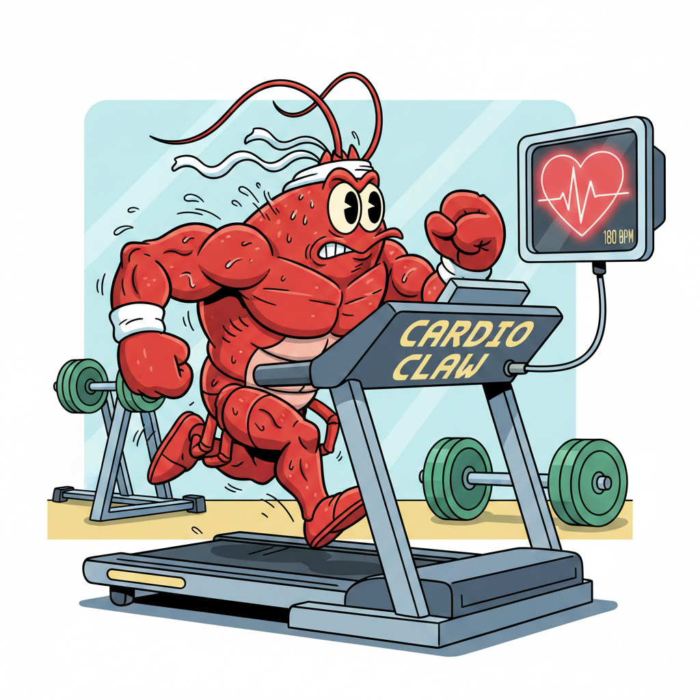
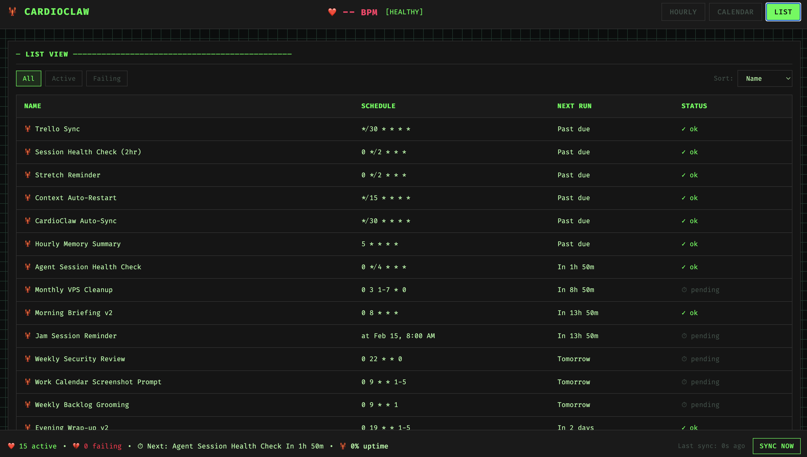
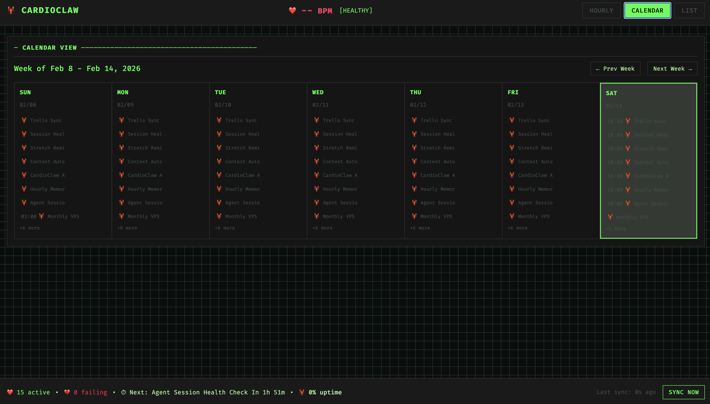
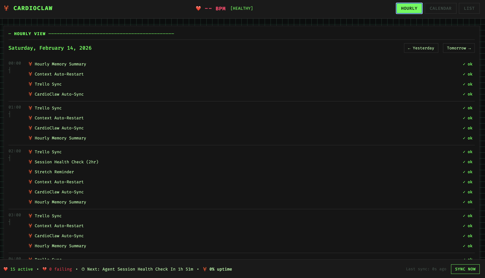

<p align="center">
  
</p>

<h1 align="center">🫀 CardioClaw</h1>

<p align="center">
  <strong>YAML-based heartbeat orchestration for OpenClaw.</strong>
</p>

Define recurring tasks in clean YAML, sync to OpenClaw cron jobs with one command, and visualize everything on a timeline dashboard.

Inspired by [Antfarm](https://antfarm.cool) — simple, self-contained, shippable.

---

## Install

```bash
curl -fsSL https://raw.githubusercontent.com/dave-melillo/cardioclaw/main/scripts/install.sh | bash
```

v0.2.0

Paste in your terminal, or ask your OpenClaw to run it.

**Requirements:** Node.js 16+ and OpenClaw CLI installed.

<details>
<summary>Manual install</summary>

```bash
git clone https://github.com/dave-melillo/cardioclaw
cd cardioclaw
npm install
npm link
```

</details>

---

## Quick Start

### Already have OpenClaw cron jobs?

Import them into your YAML with one command:

```bash
cardioclaw import
```

```
🔍 Fetching OpenClaw cron jobs...
   Found 12 job(s)

📊 Import summary:
   → 12 new heartbeat(s) to add

✅ Imported 12 heartbeat(s)
   Written to: ~/.cardioclaw/cardioclaw.yaml
```

Now all your existing heartbeats are in one YAML file. Edit, review, and manage from there.

---

### Starting fresh? Create your heartbeats

```bash
nano ~/.cardioclaw/cardioclaw.yaml
```

```yaml
heartbeats:
  - name: Morning Briefing
    schedule: "0 8 * * *"
    prompt: "Run morning briefing: weather, calendar, inbox"
    delivery: telegram

  - name: Gym Reminder
    schedule: at 2026-02-15 18:00
    message: "Reminder: Gym at 6 PM! 🏋️"
    sessionTarget: main
    delivery: telegram
```

### 2. Sync to OpenClaw

```bash
cardioclaw sync
```

```
📖 Reading: cardioclaw.yaml
🫀 Found 2 heartbeat(s)

✓ Created: Morning Briefing
✓ Created: Gym Reminder

✅ Summary:
   ✓ 2 job(s) created
```

### 3. Check status

```bash
cardioclaw status
```

```
🫀 CardioClaw Status

📊 Active (14 jobs):

  📋 ✓ Morning Briefing (beast)
      Next: Tomorrow 8:00 AM
  📋 ✓ Gym Reminder
      Next: Today 6:00 PM
  ...

────────────────────────────────────────────────────────────
  Managed: 2 | Unmanaged: 12 | Failing: 0
  Next run: Gym Reminder in 3h 12m
```

### 4. Launch dashboard

```bash
cardioclaw dashboard
```

```
🫀 CardioClaw Dashboard
   → http://localhost:3333

Press Ctrl+C to stop
```

Open http://localhost:3333 to see the timeline.

---

## YAML Schema

```yaml
# Optional: Global defaults
defaults:
  timezone: America/New_York  # Default timezone for all schedules

heartbeats:
  - name: string              # Required: Unique job name
    schedule: string          # Required: Cron expr OR "at YYYY-MM-DD HH:MM"
    
    # Payload (choose one):
    prompt: string            # For agentTurn — runs agent in isolated session
    message: string           # For systemEvent — injects text into main session
    
    # Optional:
    tz: string                # Per-heartbeat timezone override
    delivery: string          # "telegram" | "discord" | "none" (default: none)
    sessionTarget: string     # "isolated" | "main" (auto-detected from payload)
    model: string             # Model override (e.g., "opus", "sonnet")
    agent: string             # Agent name (for multi-agent setups)
```

### Schedule Formats

**Cron expressions:**
```yaml
schedule: "0 8 * * *"        # Daily at 8 AM
schedule: "0 19 * * 1-5"     # Weekdays at 7 PM
schedule: "0 */2 * * *"      # Every 2 hours
schedule: "0 9 * * MON"      # Mondays at 9 AM
```

**One-shot (absolute time):**
```yaml
schedule: at 2026-02-15 18:00           # Uses default timezone
schedule: at 2026-02-15 18:00 UTC       # Explicit UTC
schedule: at 2026-02-15 18:00 EST       # Explicit timezone
schedule: at 2026-02-15 14:00 America/Los_Angeles  # Full IANA timezone
```

### Timezone Handling

All times are interpreted in your **system's local timezone** by default. Override with:

1. **Global default** — set `defaults.timezone` at the top of your YAML
2. **Per-heartbeat** — add `tz:` to any heartbeat
3. **Inline** — append timezone to the schedule string (e.g., `at 2026-02-15 18:00 UTC`)

```yaml
# Example: Set timezone for all heartbeats
defaults:
  timezone: America/New_York
```

---

## Commands

| Command | Description |
|---------|-------------|
| `cardioclaw import` | Import existing OpenClaw cron jobs into YAML |
| `cardioclaw sync` | Read YAML, create OpenClaw cron jobs |
| `cardioclaw status` | Show all heartbeats and system health |
| `cardioclaw discover` | Refresh all OpenClaw cron jobs |
| `cardioclaw dashboard` | Start web dashboard at localhost:3333 |
| `cardioclaw prune` | Remove old completed one-shot heartbeats from YAML |
| `cardioclaw runs [job-name]` | Show execution history for a heartbeat |

**Options:**
- `-c, --config <path>` — Path to config file (default: `cardioclaw.yaml`)
- `--dry-run` — Preview without making changes (import/sync/prune)
- `-p, --port <port>` — Dashboard port (default: 3333)
- `--days <n>` — Remove completed jobs older than N days (prune)
- `--before <date>` — Remove completed jobs before date YYYY-MM-DD (prune)
- `--all` — Show runs for all jobs (runs)
- `--limit <n>` — Number of runs to show (runs, default: 20)
- `--no-refresh` — Skip discovery refresh (runs)
- `-v, --verbose` — Show error messages (runs)

---

## Examples

### Morning Briefing (Recurring)

```yaml
- name: Morning Briefing
  schedule: "0 8 * * *"
  prompt: |
    Run morning briefing:
    - Weather for today
    - Calendar events
    - Inbox summary
    Keep it under 6 sentences.
  delivery: telegram
```

### Evening Wrap-up (Weekdays Only)

```yaml
- name: Evening Wrap-up
  schedule: "0 19 * * 1-5"
  prompt: "Evening wrap: what got done today, what's tomorrow"
  delivery: telegram
```

### One-Shot Reminder

```yaml
- name: Gym Reminder
  schedule: at 2026-02-15 18:00
  message: "Reminder: Gym at 6 PM! 🏋️"
  sessionTarget: main
  delivery: telegram
```

**One-Shot Lifecycle:**
1. **Before execution:** Shows in `cardioclaw status` under "Upcoming One-Shots"
2. **After execution:** Automatically moved to `heartbeats_completed:` section in YAML
3. **Cleanup:** Run `cardioclaw prune --days 30` to remove old completed entries

**Example of auto-archived one-shot:**
```yaml
heartbeats_completed:
  - name: Gym Reminder
    schedule: at 2026-02-15 18:00
    executed_at: 2026-02-15T18:00:05-05:00
    status: ok
    message: "Reminder: Gym at 6 PM! 🏋️"
```

### Weekly Review

```yaml
- name: Weekly Review
  schedule: "0 17 * * 5"
  prompt: |
    Weekly review:
    - What got done this week?
    - What's priority for next week?
    - Any blockers?
  delivery: telegram
  model: opus
```

### Conversational Pipelines

Chain multiple tasks with natural language — no special syntax needed:

```yaml
- name: Weekly Report Pipeline
  schedule: "0 9 * * 1"
  prompt: |
    Run the weekly report pipeline:
    1. First, run scripts/gather-metrics.sh
    2. Then, run scripts/analyze-data.py
    3. Finally, summarize the results and send to Telegram
    
    If any step fails, stop and report the error.
  delivery: telegram
```

The agent understands "first... then... finally" and executes sequentially. No special parsing required — just natural language.

### Auto-Sync (Recommended Default)

Keep your YAML in sync with OpenClaw cron jobs:

```yaml
- name: CardioClaw Auto-Sync
  schedule: "*/30 * * * *"
  prompt: "Run cardioclaw import to sync any new OpenClaw cron jobs into the YAML file. No need to report back unless there are errors."
```

This ensures jobs created via `openclaw cron add` are automatically imported into your YAML.

### Execution History

Track when heartbeats actually ran (vs when they were scheduled):

```bash
# Show last 20 runs for specific job
cardioclaw runs "Morning Briefing"

# Show last 10 runs for all jobs
cardioclaw runs --all --limit 10

# Show runs with error details
cardioclaw runs "Evening Wrap-up" --verbose
```

**Example output:**
```
🫀 Execution History: Morning Briefing

Last 20 runs:

  Feb 14, 08:00 AM   ✓ ok       1m 30s
  Feb 13, 08:00 AM   ✓ ok       1m 42s
  Feb 12, 08:00 AM   ✓ ok       1m 31s
  Feb 11, 08:00 AM   ✓ ok       1m 13s
  Feb 10, 08:00 AM   ✗ error    2m 0s
  ...

────────────────────────────────────────────────────────────
  Success rate: 95% (19/20)
  Avg duration: 1m 26s
```

**Automatic capture:**
- Runs are captured passively during `sync`/`status`
- Stores: timestamp, status (ok/error), duration, error message
- Retention: Last 100 runs per job OR 90 days (auto-pruned on sync)

**API endpoints:**
- `GET /api/runs?job_id=<id>&limit=50` — Get run history
- `GET /api/runs/summary` — Get success rates (last 7 days)

---

## Dashboard

**Terminal-aesthetic UI** with three views for monitoring heartbeats.

<p align="center">
  
</p>

<p align="center">
  
</p>

<p align="center">
  
</p>

```bash
cardioclaw dashboard         # Start at localhost:3333
cardioclaw dashboard -p 8080 # Custom port
```

**Three Views:**
- **Hourly** — 24-hour timeline showing today's heartbeats (00:00-23:59)
- **Calendar** — 7-day week view for long-term scheduling
- **List** — Table with success rates, filters, and sorting

**Visual Style:**
- Dark theme (#0a0a0a background, Matrix green #00ff41 accents)
- Monospace font (Fira Code)
- ASCII box-drawing characters (│ ─ ┌ ┐)
- Lobster icons (🦞) everywhere
- Color-coded status: green (ok), red (error), cyan (upcoming)

**Features:**
- Click any job → Detail modal with execution history
- System health panel (footer KPIs)
- Auto-refresh every 30 seconds
- Mobile responsive
- Keyboard shortcuts: `1`/`2`/`3` (views), `r` (refresh), `Esc` (close modal)

**API Endpoints:**
- `GET /api/heartbeats` — List all jobs
- `GET /api/status` — System health summary
- `GET /api/runs?job_id=<id>` — Execution history
- `GET /api/runs/summary` — Success rates (last 7 days)
- `POST /api/refresh` — Trigger discovery refresh

---

## How It Works

**State Storage:** SQLite at `~/.cardioclaw/state.db`

**Sync:** Parse YAML → call `openclaw cron add` for each heartbeat

**Discovery:** Query `openclaw cron list` → update SQLite → mark managed vs unmanaged

**Tech Stack:** Node.js, Commander, SQLite (better-sqlite3), Express, Tailwind

---

## Uninstall

```bash
npm unlink -g cardioclaw
rm -rf ~/.cardioclaw
```

---

## License

MIT

---

Built for **OpenClaw** by Dave Melillo.

**Simple, self-contained, shippable.** 🫀
